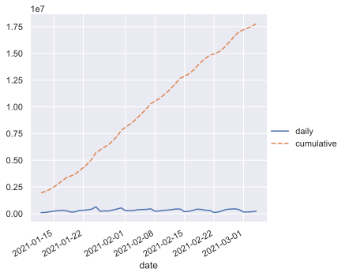

```python
# Install a conda package in the current Jupyter kernel
import sys
!{sys.executable} -m pip install numpy
!{sys.executable} -m pip install pandas
!{sys.executable} -m pip install scikit-learn
!{sys.executable} -m pip install matplotlib
!{sys.executable} -m pip install seaborn
```

    Requirement already satisfied: numpy in /Library/Frameworks/Python.framework/Versions/3.9/lib/python3.9/site-packages (1.19.5)
    WARNING: You are using pip version 20.3.1; however, version 20.3.3 is available.
    You should consider upgrading via the '/Library/Frameworks/Python.framework/Versions/3.9/bin/python3 -m pip install --upgrade pip' command.
    Requirement already satisfied: pandas in /Library/Frameworks/Python.framework/Versions/3.9/lib/python3.9/site-packages (1.2.1)
    Requirement already satisfied: python-dateutil>=2.7.3 in /Library/Frameworks/Python.framework/Versions/3.9/lib/python3.9/site-packages (from pandas) (2.8.1)
    Requirement already satisfied: pytz>=2017.3 in /Library/Frameworks/Python.framework/Versions/3.9/lib/python3.9/site-packages (from pandas) (2020.5)
    Requirement already satisfied: numpy>=1.16.5 in /Library/Frameworks/Python.framework/Versions/3.9/lib/python3.9/site-packages (from pandas) (1.19.5)
    Requirement already satisfied: six>=1.5 in /Library/Frameworks/Python.framework/Versions/3.9/lib/python3.9/site-packages (from python-dateutil>=2.7.3->pandas) (1.15.0)
    WARNING: You are using pip version 20.3.1; however, version 20.3.3 is available.
    You should consider upgrading via the '/Library/Frameworks/Python.framework/Versions/3.9/bin/python3 -m pip install --upgrade pip' command.
    Requirement already satisfied: scikit-learn in /Library/Frameworks/Python.framework/Versions/3.9/lib/python3.9/site-packages (0.24.1)
    Requirement already satisfied: joblib>=0.11 in /Library/Frameworks/Python.framework/Versions/3.9/lib/python3.9/site-packages (from scikit-learn) (1.0.0)
    Requirement already satisfied: threadpoolctl>=2.0.0 in /Library/Frameworks/Python.framework/Versions/3.9/lib/python3.9/site-packages (from scikit-learn) (2.1.0)
    Requirement already satisfied: scipy>=0.19.1 in /Library/Frameworks/Python.framework/Versions/3.9/lib/python3.9/site-packages (from scikit-learn) (1.6.0)
    Requirement already satisfied: numpy>=1.13.3 in /Library/Frameworks/Python.framework/Versions/3.9/lib/python3.9/site-packages (from scikit-learn) (1.19.5)
    Requirement already satisfied: numpy>=1.13.3 in /Library/Frameworks/Python.framework/Versions/3.9/lib/python3.9/site-packages (from scikit-learn) (1.19.5)
    WARNING: You are using pip version 20.3.1; however, version 20.3.3 is available.
    You should consider upgrading via the '/Library/Frameworks/Python.framework/Versions/3.9/bin/python3 -m pip install --upgrade pip' command.
    Requirement already satisfied: matplotlib in /Library/Frameworks/Python.framework/Versions/3.9/lib/python3.9/site-packages (3.3.3)
    Requirement already satisfied: numpy>=1.15 in /Library/Frameworks/Python.framework/Versions/3.9/lib/python3.9/site-packages (from matplotlib) (1.19.5)
    Requirement already satisfied: pillow>=6.2.0 in /Library/Frameworks/Python.framework/Versions/3.9/lib/python3.9/site-packages (from matplotlib) (8.1.0)
    Requirement already satisfied: cycler>=0.10 in /Library/Frameworks/Python.framework/Versions/3.9/lib/python3.9/site-packages (from matplotlib) (0.10.0)
    Requirement already satisfied: kiwisolver>=1.0.1 in /Library/Frameworks/Python.framework/Versions/3.9/lib/python3.9/site-packages (from matplotlib) (1.3.1)
    Requirement already satisfied: python-dateutil>=2.1 in /Library/Frameworks/Python.framework/Versions/3.9/lib/python3.9/site-packages (from matplotlib) (2.8.1)
    Requirement already satisfied: pyparsing!=2.0.4,!=2.1.2,!=2.1.6,>=2.0.3 in /Library/Frameworks/Python.framework/Versions/3.9/lib/python3.9/site-packages (from matplotlib) (2.4.7)
    Requirement already satisfied: six in /Library/Frameworks/Python.framework/Versions/3.9/lib/python3.9/site-packages (from cycler>=0.10->matplotlib) (1.15.0)
    Requirement already satisfied: six in /Library/Frameworks/Python.framework/Versions/3.9/lib/python3.9/site-packages (from cycler>=0.10->matplotlib) (1.15.0)
    WARNING: You are using pip version 20.3.1; however, version 20.3.3 is available.
    You should consider upgrading via the '/Library/Frameworks/Python.framework/Versions/3.9/bin/python3 -m pip install --upgrade pip' command.


```python
import numpy as np
import pandas as pd
import matplotlib.pyplot as plt
import matplotlib.ticker as ticker
from sklearn.linear_model import LinearRegression, SGDRegressor
from sklearn.ensemble import RandomForestRegressor, GradientBoostingRegressor, VotingRegressor
```


```python
cumulative_vaccinations = [
    1959151,
    2080280,
    2254556,
    2494371,
    2769164,
    3090058,
    3365492,
    3520056,
    3687206,
    3985579,
    4303730,
    4661293,
    5085771,
    5727693,
    5962544,
    6221850,
    6473752,
    6816945,
    7253305,
    7792996,
    8082355,
    8362868,
    8663041,
    9041835,
    9430261,
    9831897,
    ]

daily_inoculations = [100000]

for i, x in enumerate(cumulative_vaccinations):
    if len(cumulative_vaccinations) > i+1:
        daily_inoculations.append(cumulative_vaccinations[i+1] - x)

dataframe = pd.DataFrame({'date': pd.date_range(start='1/12/2021', end='2/6/2021'), 'daily': daily_inoculations, 'cumulative': cumulative_vaccinations})
dataframe.set_index('date', inplace=True)
```


```python
from datetime import datetime, timedelta

reg = LinearRegression()

x = np.array([x.timetuple().tm_yday for x in dataframe.index]).reshape(-1, 1)
y = dataframe['daily']

reg.fit(x, y)
```


    LinearRegression()


```python
import math
start = 11 + len(dataframe)
prediction_range = range(start, start + 40)
prediction_range_array = np.array(prediction_range).reshape(-1, 1)
projection = reg.predict(prediction_range_array)
projection = [x - (math.log(x) * 650 * i) for i, x in enumerate(projection, start=1)]
print(projection)
```

    [409138.58884710673, 408972.83673680574, 408778.4398071447, 408556.2655054408, 408307.13542341255, 408031.82864211284, 407731.0847703938, 407405.60671039595, 407056.0631793296, 406683.09101319313, 406287.2972749559, 405869.2611870443, 405429.5359056423, 404968.6501522977, 404487.10971657396, 403985.39884195046, 403463.98150584253, 402923.30260343535, 402363.7890440009, 401785.8507674578, 401189.88168814033, 400576.2605720327, 399945.3518531034, 399297.5063938205, 398633.06219443417, 397952.34505517944, 397255.66919515433, 396543.3378312893, 395815.6437205007, 395072.8696678533, 394315.28900329163, 393543.16602929146, 392756.7564415608, 391956.30772475485, 391142.05952498777, 390314.24400078884, 389473.086154003, 388618.80414202437, 387751.6095726306, 386871.7077825903]


```python

prediction_dates = [(datetime(2021, 1, 1) + timedelta(x)) for x in prediction_range]
result_df = pd.DataFrame({'date': prediction_dates, 'daily': projection})
result_df.set_index('date', inplace=True)
```


```python
last_known = dataframe['cumulative'][-1]
# print(last_known)
projection_cumulative = []
for x in projection:
    projection_cumulative.append(last_known + x)
    last_known = last_known + x
result_df['cumulative'] = projection_cumulative
print(result_df)
```

                        daily    cumulative
    date                                   
    2021-02-07  413021.702784  1.024492e+07
    2021-02-08  416751.733959  1.066167e+07
    2021-02-09  420465.396666  1.108214e+07
    2021-02-10  424163.186589  1.150630e+07
    2021-02-11  427845.573209  1.193414e+07
    2021-02-12  431513.001715  1.236566e+07
    2021-02-13  435165.894741  1.280082e+07
    2021-02-14  438804.653944  1.323963e+07
    2021-02-15  442429.661450  1.368206e+07
    2021-02-16  446041.281165  1.412810e+07
    2021-02-17  449639.859981  1.457774e+07
    2021-02-18  453225.728883  1.503096e+07
    2021-02-19  456799.203961  1.548776e+07
    2021-02-20  460360.587340  1.594812e+07
    2021-02-21  463910.168043  1.641203e+07
    2021-02-22  467448.222781  1.687948e+07
    2021-02-23  470975.016685  1.735046e+07
    2021-02-24  474490.803979  1.782495e+07
    2021-02-25  477995.828611  1.830294e+07
    2021-02-26  481490.324834  1.878443e+07
    2021-02-27  484974.517741  1.926941e+07
    2021-02-28  488448.623770  1.975786e+07
    2021-03-01  491912.851169  2.024977e+07
    2021-03-02  495367.400430  2.074514e+07
    2021-03-03  498812.464697  2.124395e+07
    2021-03-04  502248.230141  2.174620e+07
    2021-03-05  505674.876317  2.225187e+07
    2021-03-06  509092.576490  2.276097e+07
    2021-03-07  512501.497950  2.327347e+07
    2021-03-08  515901.802301  2.378937e+07
    2021-03-09  519293.645731  2.430866e+07
    2021-03-10  522677.179269  2.483134e+07
    2021-03-11  526052.549029  2.535739e+07
    2021-03-12  529419.896429  2.588681e+07
    2021-03-13  532779.358410  2.641959e+07
    2021-03-14  536131.067634  2.695572e+07
    2021-03-15  539475.152674  2.749520e+07
    2021-03-16  542811.738191  2.803801e+07
    2021-03-17  546140.945104  2.858415e+07
    2021-03-18  549462.890748  2.913361e+07


```python
complete = pd.concat([dataframe, result_df])
print(complete)

```

                        daily    cumulative
    date                                   
    2021-01-12  100000.000000  1.959151e+06
    2021-01-13  121129.000000  2.080280e+06
    2021-01-14  174276.000000  2.254556e+06
    2021-01-15  239815.000000  2.494371e+06
    2021-01-16  274793.000000  2.769164e+06
    ...                   ...           ...
    2021-03-14  536131.067634  2.695572e+07
    2021-03-15  539475.152674  2.749520e+07
    2021-03-16  542811.738191  2.803801e+07
    2021-03-17  546140.945104  2.858415e+07
    2021-03-18  549462.890748  2.913361e+07
    
    [66 rows x 2 columns]


```python
fig = plt.figure()
ax = complete.drop('cumulative', axis=1).plot()
ax.yaxis.set_major_formatter(ticker.FuncFormatter(lambda x, p: format(int(x), ',')))
fig.show()

fig = plt.figure()
ax = complete.drop('daily', axis=1).plot()
ax.yaxis.set_major_formatter(ticker.FuncFormatter(lambda x, p: format(int(x), ',')))
fig.show()
```


    <Figure size 432x288 with 0 Axes>


    

    


    <Figure size 432x288 with 0 Axes>


    

    


```python
import seaborn as sns
sns.set_theme(style="darkgrid")
g = sns.relplot(kind="line", data=dataframe)
g.fig.autofmt_xdate()

```


    

    

